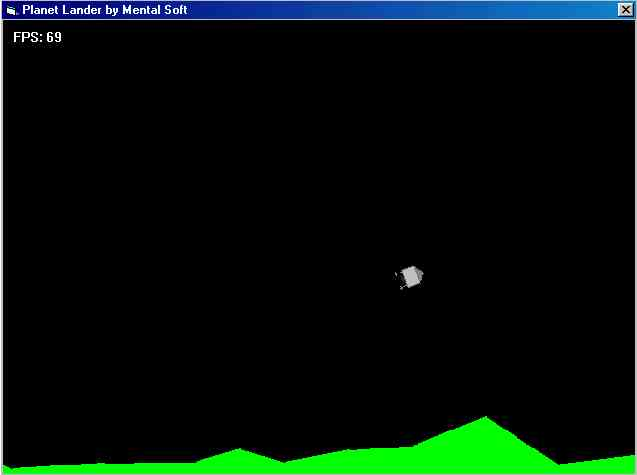



## Planetary lander

### Description

This is just simple game where you are trying to land on some planet with space ship which looks like american moon module. You use only 3 keys for controling ship. You can select how big teren is going to be generated. When you land a score is shown. My best score is 205. Please write comments and vote for me.
 
### More Info
 

             |
---                |---
**Submitted On**   |2002-01-06 19:02:02
**By**             |[Milan Satala](https://github.com/Planet-Source-Code/PSCIndex/blob/master/ByAuthor/milan-satala.md)
**Level**          |Beginner
**User Rating**    |4.7 (14 globes from 3 users)
**Compatibility**  |VB 6\.0
**Category**       |[Games](https://github.com/Planet-Source-Code/PSCIndex/blob/master/ByCategory/games__1-38.md)
**World**          |[Visual Basic](https://github.com/Planet-Source-Code/PSCIndex/blob/master/ByWorld/visual-basic.md)
**Archive File**   |[Planetary\_330381132001\.zip](https://github.com/Planet-Source-Code/milan-satala-planetary-lander__1-28620/archive/master.zip)

